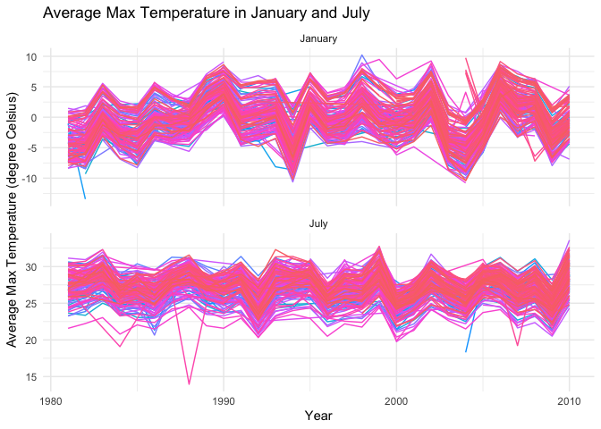
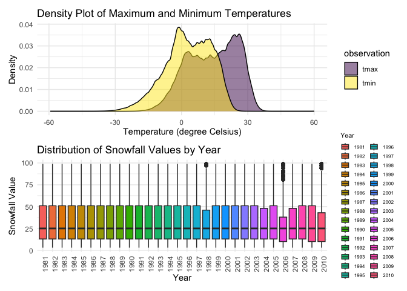
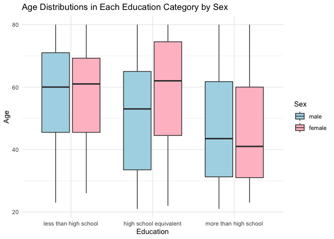
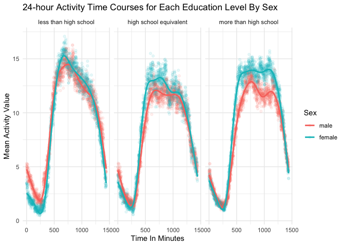
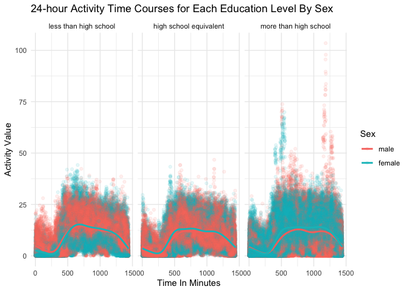
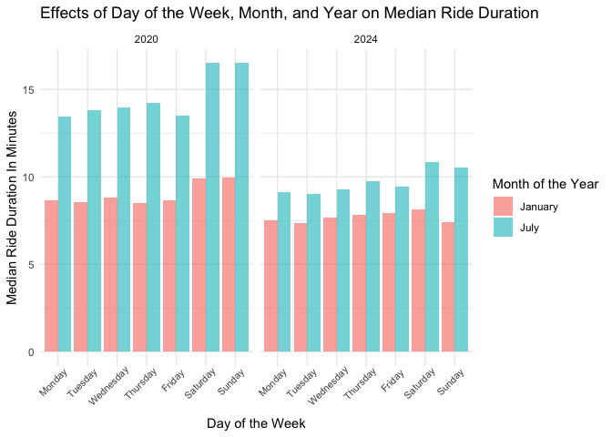
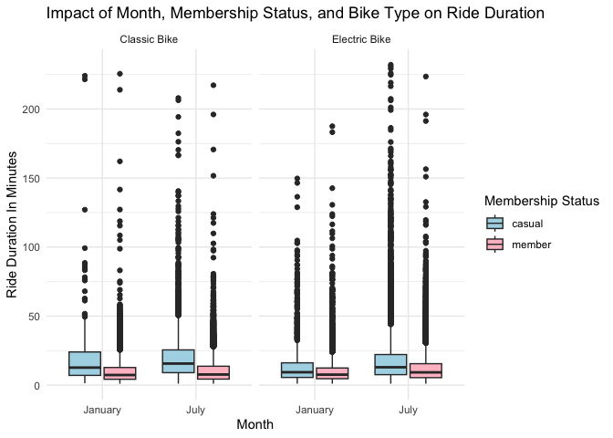

p8015_hw3_dl3757
================
Dang Lin dl3757
2024-10-16

``` r
# Import the libraries
library(tidyverse)
library(knitr)
library(patchwork)
library(p8105.datasets)
```

# Problem 1

## (a)

``` r
# Load the data and convert data to the data frame
data("ny_noaa")
ny_noaa <- as.data.frame(ny_noaa)

# Clean the dataset 
ny_noaa_tidy <- ny_noaa %>%
  mutate(
    date = as.Date(date, format = "%Y-%m-%d"),
    year = year(date),
    month = month(date),
    day = day(date), 
    prcp = as.numeric(prcp) / 10, 
    tmax = as.numeric(tmax) / 10, 
    tmin = as.numeric(tmin) / 10)

# Find the most commonly snowfall values
most_commonly_snowfall_values <- ny_noaa_tidy %>% 
  filter(!is.na(snow)) %>% 
  group_by(snow) %>% 
  summarise(count = n()) %>% 
  arrange(desc(count)) %>% 
  head(n = 5) %>% 
  rename("Snowfall Values" = snow, 
         "Count" = count)

knitr::kable(most_commonly_snowfall_values, 
             caption = "The Most Commonly Snowfall Values (mm)")
```

| Snowfall Values |   Count |
|----------------:|--------:|
|               0 | 2008508 |
|              25 |   31022 |
|              13 |   23095 |
|              51 |   18274 |
|              76 |   10173 |

The Most Commonly Snowfall Values (mm)

The most common snowfall values are 0mm, 25mm, 13mm, 51mm, and 76mm.
This is likely because the dataset only includes snowfall measurements
from New York State, rather than from the entire nation.

## (b)

``` r
# Create the average max temperature data frame 
average_tmax_df <- ny_noaa_tidy %>% 
  filter(month == 1 | month == 7) %>% 
  group_by(id, year, month) %>% 
  summarise(average_tmax = mean(tmax, na.rm = TRUE)) %>% 
  arrange(id, year, month)

# Make a two-panel plot showing the average max temperature in January and in July 
# in each station across years
average_tmax_df %>%
  ggplot(aes(x = year, y = average_tmax)) +
  geom_line(aes(color = id)) +
  facet_wrap(~ month, scales = "free_y", 
             labeller = labeller(month = c('1' = "January", '7' = "July")), 
             ncol = 1) + 
  labs(title = "Average Max Temperature in January and July", 
       x = "Year", 
       y = "Average Max Temperature (degree Celsius)") +
  theme_minimal() + 
  theme(legend.position = "none")
```

<!-- -->

From the plot, we can observe that the average maximum temperatures in
both January and July fluctuate over the years, but there is no clear
pattern. Additionally, it is worth mentioning an outlier in July 1988,
which might have been caused by extreme weather conditions in that month
or errors in the data collection process.

## (c)

``` r
# Plot the density plot of maximum and minimum temperatures
plot_1 <- ny_noaa_tidy %>% 
  filter(!is.na(tmax) & !is.na(tmin)) %>% 
  select(id, tmax, tmin) %>% 
  pivot_longer( 
    tmax:tmin, 
    names_to = "observation", 
    values_to = "temp") %>% 
  ggplot(aes(x = temp, fill = observation)) + 
  geom_density(alpha = 0.5) + 
  viridis::scale_fill_viridis(discrete = TRUE) +  
  theme_minimal() + 
  labs(title = "Density Plot of Maximum and Minimum Temperatures", 
       x = "Temperature (degree Celsius)", 
       y = "Density")

# Plot the boxplot of distribution of snowfall values by year
plot_2 <- ny_noaa_tidy %>% 
  filter(snow > 0 & snow < 100) %>% 
  ggplot(aes(x = as.factor(year), y = snow, fill = as.factor(year))) + 
  geom_boxplot() + 
  labs(title = "Distribution of Snowfall Values by Year", 
       x = "Year", 
       y = "Snowfall Value", 
       fill = "Year") + 
  theme_minimal() + 
  theme(axis.text.x = element_text(angle = 90, hjust = 0.8), 
        legend.text = element_text(size = 6), 
        legend.key.size = unit(0.4, "cm"), 
        legend.title = element_text(size = 8))

# Combine two plots into one two-panel plot
plot_1 / plot_2
```

<!-- -->

# Problem 2

## (a)

``` r
# Load and clean the dataset
demographic_data <- read_csv(paste0(
  "https://raw.githubusercontent.com/DangLin1214/p8105_hw3_dl3757/",
  "refs/heads/main/nhanes_covar.csv"), 
  skip = 4, 
  na = c("NA", ".", "")) %>% 
  janitor::clean_names()

accelerometer_data <- read_csv(paste0(
  "https://raw.githubusercontent.com/DangLin1214/p8105_hw3_dl3757/",
  "refs/heads/main/nhanes_accel.csv"), 
  na = c("NA", ".", "")) %>% 
  janitor::clean_names()

# Merge two different datasets
merged_data <- left_join(demographic_data, accelerometer_data, 
                         by = "seqn")

# Clean the merged dataset
tidy_data <- merged_data %>% 
  filter(age >= 21) %>%
  drop_na(sex, age, bmi, education) %>% 
  mutate(sex = factor(sex, levels = c(1, 2), 
                      labels = c("male", "female"))) %>% 
  mutate(education = factor(education, levels = c(1, 2, 3), 
                            labels = c("less than high school", 
                                       "high school equivalent", 
                                       "more than high school")))
```

## (b)

``` r
# Produce a table for the number of men and women in each education category
sex_education <- tidy_data %>% 
  group_by(sex, education) %>% 
  summarize(count= n()) %>% 
  pivot_wider(names_from = sex, 
              values_from = count) %>% 
  rename("Education Level" = education, 
         "Male" = male, "Female" = female)

knitr::kable(sex_education, 
             caption = "Sex and Education Category Table")
```

| Education Level        | Male | Female |
|:-----------------------|-----:|-------:|
| less than high school  |   27 |     28 |
| high school equivalent |   35 |     23 |
| more than high school  |   56 |     59 |

Sex and Education Category Table

## (c)

``` r
# Create a boxplot of age distributions in each education category by sex
ggplot(tidy_data, aes(x = education, y = age, fill = sex)) +
  geom_boxplot() +
  labs(title = "Age Distributions in Each Education Category by Sex",
       x = "Education", y = "Age", fill = "Sex") +
  scale_fill_manual(values = c("male" = "lightblue", "female" = "pink")) +
  theme_minimal()
```

<!-- -->

From the table, we can find that the distribution of education levels is
quite similar between male and female participants. Additionally, the
study included more participants with an education level higher than
high school. From the boxplot, we observe that the median age for the
“less than high school” group is around 60 years old, while the median
age for the “more than high school” group is approximately 42 years old.
This suggests that participants tend to be older as education levels
decrease, likely reflecting differences in education attainment across
generations. Furthermore, it is worth mentioning that the median age of
female participants in the “high school equivalent” group is about five
years higher than that of male participants in the same group.

## (d)

``` r
# Clean the data
tidy_longer_data <- tidy_data %>% 
  pivot_longer(
    min1:min1440, 
    names_to = "minute", 
    values_to = "minutes_value", 
    names_prefix = "min") %>% 
  group_by(minute, sex, education) %>%
  mutate(minute = as.numeric(minute)) 

# Create the plot for 24-hour activity time courses for each education level 
# by sex based on the mean minutes value
tidy_longer_data %>% 
  summarise(mean_min_value = mean(minutes_value)) %>% 
  ggplot(aes(x = minute, y = mean_min_value, color = sex)) + 
  geom_point(alpha = 0.1) + 
  geom_smooth(se = FALSE) + 
  labs(title = "24-hour Activity Time Courses for Each Education Level By Sex",
       x = "Time In Minutes", y = "Mean Activity Value", color = "Sex") + 
  facet_wrap(~ education) + 
  theme_minimal()
```

<!-- -->

``` r
# Create the plot for 24-hour activity time courses for each education level 
# by sex based on minutes value
tidy_longer_data %>% 
  ggplot(aes(x = minute, y = minutes_value, color = sex)) + 
  geom_point(alpha = 0.1) + 
  geom_smooth(se = FALSE) + 
  labs(title = "24-hour Activity Time Courses for Each Education Level By Sex",
       x = "Time In Minutes", y = "Activity Value", color = "Sex") + 
  facet_wrap(~ education) + 
  theme_minimal()
```

<!-- -->

The first plot is based on the median minute values, while the second
plot is based on individual minute values. In both plots, we observe
that both male and female participants are more active during the
afternoon, with less activity in the morning and evening. Additionally,
the first plot shows that female participants tend to have more activity
than male participants. More importantly, we see that the daily activity
pattern is not significantly affected by the participants’ education
level; only minor differences are observed across the different
education categories.

# Problem 3

## (a)

``` r
# Load and clean the dataset
jan_2020 <- read_csv(paste0(
  "https://raw.githubusercontent.com/DangLin1214/p8105_hw3_dl3757/", 
  "refs/heads/main/citibike/Jan%202020%20Citi.csv"), 
                     na = c("NA", ".", "")) %>% 
  janitor::clean_names() %>% 
  mutate(month= "January", 
         year = "2020")

jan_2024 <- read_csv(paste0(
  "https://raw.githubusercontent.com/DangLin1214/p8105_hw3_dl3757/", 
  "refs/heads/main/citibike/Jan%202024%20Citi.csv"), 
                     na = c("NA", ".", "")) %>% 
  janitor::clean_names() %>% 
  mutate(month= "January", 
         year = "2024")

july_2020 <- read_csv(paste0(
  "https://raw.githubusercontent.com/DangLin1214/p8105_hw3_dl3757/",
  "refs/heads/main/citibike/July%202020%20Citi.csv"), 
                     na = c("NA", ".", "")) %>% 
  janitor::clean_names() %>% 
  mutate(month= "July", 
         year = "2020")

july_2024 <- read_csv(paste0(
  "https://raw.githubusercontent.com/DangLin1214/p8105_hw3_dl3757/",
  "refs/heads/main/citibike/July%202024%20Citi.csv"), 
                     na = c("NA", ".", "")) %>% 
  janitor::clean_names() %>% 
  mutate(month= "July", 
         year = "2024")

# Merge different datasets
tidy_dataset <- 
  bind_rows(jan_2020, jan_2024, july_2020, july_2024) %>% 
  mutate(duration = as.numeric(duration), 
         year = as.character(year), 
         month = as.character(month)) %>%
  select(year, month, everything())
```

After the data cleaning and merging steps, the resulting dataset
contains 99,485 observations and 9 variables. We created new variables,
“year” and “month,” and converted them to the character type. Other
important variables in the dataset include “ride_id,” “rideable_type,”
“duration,” “member_casual,” etc.

## (b)

``` r
# Produce a table for the total number of rides by year and month
total_number_of_rides <- tidy_dataset %>% 
  group_by(year, month, member_casual) %>% 
  summarize(count= n()) %>% 
  pivot_wider(names_from = member_casual, 
              values_from = count) %>% 
  rename("Casual Riders" = casual, 
         "Member Riders" = member)

knitr::kable(total_number_of_rides, 
             caption = "Total Number of Rides by Year and Month, 
             Separated by Casual Riders and Citi Bike Members")
```

| year | month   | Casual Riders | Member Riders |
|:-----|:--------|--------------:|--------------:|
| 2020 | January |           984 |         11436 |
| 2020 | July    |          5637 |         15411 |
| 2024 | January |          2108 |         16753 |
| 2024 | July    |         10894 |         36262 |

Total Number of Rides by Year and Month, Separated by Casual Riders and
Citi Bike Members

From the table, we can observe that more people joined the rides from
2020 to 2024. In addition, both the number of members and casual riders
increased significantly, but the number of members is still much higher
than that of casual riders. Furthermore, more people tend to ride in
July than in January, regardless of whether it’s 2020 or 2024, likely
due to better weather conditions in July.

## (c)

``` r
# Produce a table showing the 5 most popular starting stations for July 2024
popular_starting_stations <- tidy_dataset %>% 
  filter(year == "2024" & month == "July") %>% 
  group_by(start_station_name) %>% 
  summarise(number_of_rides = n()) %>%
  arrange(desc(number_of_rides)) %>% 
  head(n = 5) %>% 
  rename("Start Station Name" = start_station_name, 
         "Number of Rides" = number_of_rides)

knitr::kable(popular_starting_stations, 
             caption = "The 5 Most Popular Starting Stations For July 2024")
```

| Start Station Name       | Number of Rides |
|:-------------------------|----------------:|
| Pier 61 at Chelsea Piers |             163 |
| University Pl & E 14 St  |             155 |
| W 21 St & 6 Ave          |             152 |
| West St & Chambers St    |             150 |
| W 31 St & 7 Ave          |             146 |

The 5 Most Popular Starting Stations For July 2024

## (d)

``` r
# Clean the dataset and calculate the median ride duration
median_ride_duration <- tidy_dataset %>% 
  group_by(year, month, weekdays) %>% 
  summarise(median_ride_duration = median(duration, na.rm = TRUE)) %>% 
  mutate(weekdays = factor(weekdays, levels = c("Monday", "Tuesday", "Wednesday", 
                                                "Thursday", "Friday", "Saturday", 
                                                "Sunday")))

# Make a plot for effects of day of the week, month, and year on median ride duration
median_ride_duration %>%
  ggplot(aes(x = weekdays, y = median_ride_duration, fill = month)) + 
  geom_bar(stat = "identity", position = "dodge", alpha = 0.6) + 
  labs(title = "Effects of Day of the Week, Month, and Year on Median Ride Duration",
       x = "Day of the Week", 
       y = "Median Ride Duration In Minutes", 
       fill = "Month of the Year") + 
  facet_wrap(~ year) + 
  theme_minimal() +
  theme(axis.text.x = element_text(angle = 45, hjust = 0.8, size = 8))
```

<!-- -->

From the bar plot above, we can observe that people tend to ride more in
July than in January, regardless of whether it’s 2020 or 2024. Besides,
compared to 2020, riders in 2024 have shorter ride duration in both
January and July. Furthermore, it is worth mentioning that people tend
to ride more on weekends than on weekdays, likely because they have more
spare time.

## (e)

``` r
# Clean the dataset
citi_bike_2024 <- tidy_dataset %>% 
  filter(year == "2024")

# Make a plot for the impact of month, membership status, and bike type on ride duration
citi_bike_2024 %>%
  ggplot(aes(x = month, y = duration, fill = member_casual)) + 
  geom_boxplot() + 
  labs(title = "Impact of Month, Membership Status, and Bike Type on Ride Duration",
       x = "Month", 
       y = "Ride Duration In Minutes", 
       fill = "Membership Status") + 
  facet_wrap(~ rideable_type, 
             labeller = as_labeller(c('classic_bike' = 'Classic Bike', 
                                      'electric_bike' = 'Electric Bike'))) + 
  scale_fill_manual(values = c("casual" = "lightblue", "member" = "pink")) +
  theme_minimal()
```

<!-- -->

From the boxplots above, we can observe that the median ride duration
for casual riders is higher than that of member riders in both January
and July, regardless of whether it’s 2020 or 2024, suggesting that
casual riders tend to have longer ride duration. Besides, there is only
a minor difference in ride duration between classic bikes and electric
bikes. Additionally, it is worth mentioning the presence of numerous
outliers in the boxplots, indicating that some riders enjoy longer rides
and tend to have extended ride duration.
